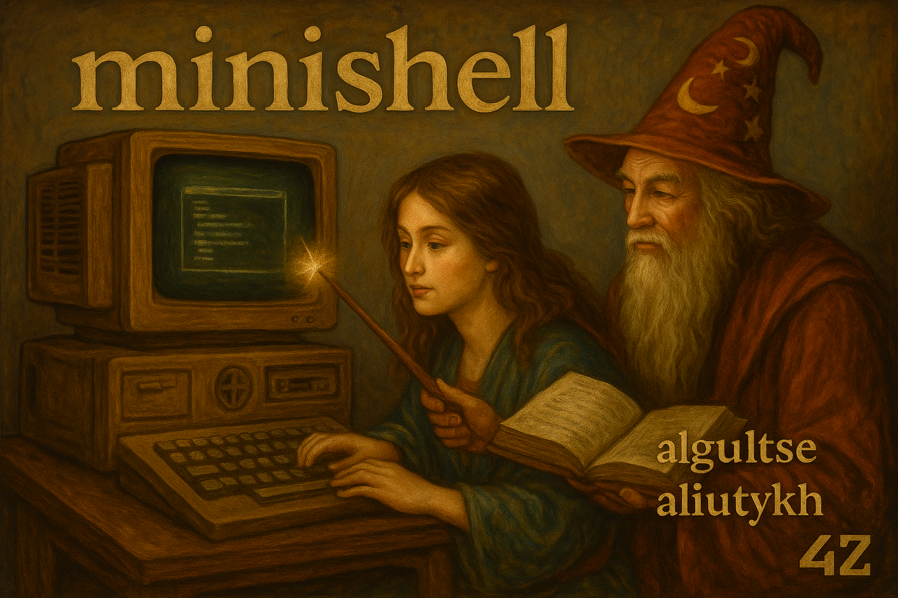
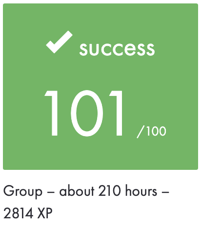

|          Grade           |                           |
|:------------------------:|:-------------------------:|
|  |  |

<br>

---

<details>
<summary>🇫🇷 FRENCH VERSION</summary>

<p align="center">
	Ceci est un <a href="./subject/Minishell.pdf">projet</a> réalisé à l’école 42 (terminé en septembre 2024).
</p>

## Préambule
Le but est d’implémenter un `shell qui reproduit le comportement de` **`bash`**, qui interprète des commandes, gère les redirections, les pipes, les variables d’environnement et les signaux. Un retour aux bases de l’informatique système.

## Fonctionnalités :
- Exécution de builtins (`cd`, `echo`, `env`, `exit`, `export`, `unset`, `pwd`, etc.)
- Gestion des redirections (`<`, `>`, `>>`, `<<`, `heredoc`)
- Pipes (`|`)
- Expansion des variables d’environnement (`$VAR`, `$?`, etc.)
- Gestion des signaux (`Ctrl+C`, `Ctrl+D`, `Ctrl+\`)
- Gestion de l’historique avec `readline`
- Bonus : comportement des guillemets identique à `bash` (ex. echo `"'`$USER`'"`)

## Installation
```bash
git clone https://github.com/N0fish/minishell_42.git
cd minishell_42
make
```

## Utilisation
```bash
./minishell
```

## Pour tester
```bash
make test
```

## Pour valgrind
```bash
make && valgrind --suppressions=./minimal.supp --track-fds=yes --trace-children=yes --leak-check=full --show-leak-kinds=all ./minishell
```

## Installer readline:
Mac
```bash
brew install readline
```
Linux
```bash
sudo apt install libreadline-dev
```

</details>

---

<details>
<summary>🇬🇧 ENGLISH VERSION</summary>

<p align="center">
    This is a <a href="./subject/Minishell.pdf">project</a> done at 42 School (completed in September 2024).
</p>

## Preamble
The goal is to implement a `shell that mimics` **`bash`** behavior and supports command execution, redirections, pipes, environment variable handling, and signal management. A deep dive into system programming.

## Features:
- Built-in commands (`cd`, `echo`, `env`, `exit`, `export`, `unset`, `pwd`, etc.)
- Redirections (`<`, `>`, `>>`, `<<`, `heredoc`)
- Pipes (`|`)
- Environment variable expansion (`$VAR`, `$?`, etc.)
- Signal handling (`Ctrl+C`, `Ctrl+D`, `Ctrl+\`)
- History management via `readline`
- Bonus: quoting behavior identical to `bash` (e.g. echo `"'`$USER`'"`)

## Installation
```bash
git clone https://github.com/N0fish/minishell_42.git
cd minishell_42
make
```

## Usage
```bash
./minishell
```

## To test
```bash
make test
```

## For valgrind
```bash
make && valgrind --suppressions=./minimal.supp --track-fds=yes --trace-children=yes --leak-check=full --show-leak-kinds=all ./minishell
```

## Install readline:
Mac
```bash
brew install readline
```
Linux
```bash
sudo apt install libreadline-dev
```

</details>

---

<details>
<summary>🇷🇺 RUSSIAN VERSION</summary>

<p align="center">
    Это <a href="./subject/Minishell.pdf">проект</a>, выполненный в школе 42 (завершён в сентябре 2024 года).
</p>

## Преамбула
Цель — реализовать `shell, повторяющий поведение` **`bash`**, поддерживающий выполнение команд, перенаправления, пайпы, переменные окружения и сигналы. Погружение в основы системного программирования.

## Функции:
- Встроенные команды (`cd`, `echo`, `env`, `exit`, `export`, `unset`, `pwd`, и др.)
- Перенаправления ввода/вывода (`<`, `>`, `>>`, `<<`, `heredoc`)
- Пайпы (`|`)
- Управление и использование переменных окружения (`$VAR`, `$?`, и др.)
- Обработка сигналов (`Ctrl+C`, `Ctrl+D`, `Ctrl+\`)
- История команд через `readline`
- Бонус: обработка кавычек как в `bash` (например, echo `"'`$USER`'"`)

## Установка
```bash
git clone https://github.com/N0fish/minishell_42.git
cd minishell_42
make
```

## Использование
```bash
./minishell
```

## Для тестирования
```bash
make test
```

## Для valgrind
```bash
make && valgrind --suppressions=./minimal.supp --track-fds=yes --trace-children=yes --leak-check=full --show-leak-kinds=all ./minishell
```

## Установка readline:
Mac
```bash
brew install readline
```
Linux
```bash
sudo apt install libreadline-dev
```

</details>

---

<br>
